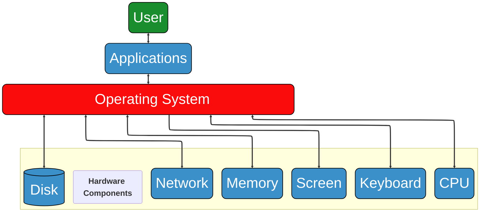

```{important} Learning outcomes
:icon: false

After completing this section you should be able to:
- explain fundamental computational concepts like CPU, memory, network, file system compression, indexing
- be proficient in command line (shell) usage **#!this should be more specified I think**
```

## Introduction
In this section, we will connect to a remote server running on Linux and we will explore various computational concepts in a hands-on way.

## Operating systems
```{seealso}
Computing Skills for Biologists - a Tool box
**Ch1.1** and **1.2**
```
An {term}`operating system`(OS) is the software that manages computer hardware and software resources of computing devices and acts as an interface between the user and hardware, illustrated in {numref}`operating_system`. More simply put, an operating system acts as a bridge between you (the user) and your computer. 


:::{figure}
:label: operating_system


Role of operating system in connecting the user with the hardware and software of a computer
:::

An operating system contains two basic components: 
- The {term}`kernel` is the core component of the operating system. It contains the software libraries that are required to interact with the hardware and is therefore the primary interface between the operating system and the hardware
- The {term}`shell` is the outermost layer of the operating system. It acts as an intermediate between the user and the operating system. It interprets input for the operating system and handles the output from the operating system.

Some operating systems you might be familiar with:
- Windows
- OSX
- Linux
- Unix
- Android
- iOS
- Chrome OS


In this course, we will use Linux. It was created by Linus Torvalds **#!wiki links?** and has various advantages:
- Linux has a powerful (remote) shell
- Linux has many software tools available
- Supercomputers run Linux

The Linux {term}`kernel` is typically bundled with several applications into a Linux distribution to make it more user friendly. You can choose between a lot of different distributions for different purposes, for an overview see: [Linux distribution](wiki:Linux_distribution). 

We will work on the WUR Bioinformatics servers, which all run Ubuntu (one of the most popular Linux distributions). The server we will mostly work on is called **#!smith, still correct?**, named after bioinformatician Temple Ferris Smith, who developed the Smith-Waterman algorithm for DNA sequence alignment together with Michael Waterman.

**#!additional funfact card? for the smith-waterman reference**

## Working on a remote server
**#! include "working on the bioinformatics servers picture in slide 18?**

Now we will connect to the server **#! server name**. 

```{exercise} Connecting to **#! server name** from ...
Follow the “Connecting to **#! server name** from ...” description on Brightspace that is appropriate for your operating system (Windows or macOS). If you have another OS, ask one of the teachers.
```

**#! Restructure this so it flows more logically**
If everything worked out well and you logged in to **#! server name**, you should see a list of all our servers and their current usage, followed by a so-called {term}`prompt` looks something like this:

`user001@server:~$` **#! change to image?**

This is the {term}`command-line interface` that allows you to type all kinds of commands. The commands you type are actually handled by the {term}`shell`.


``````{exercise} Who am I?
You are now a Linux user identified by your WUR username. To see your username you can type `whoami` after the {term}`prompt`, followed by the enter key. For example:

```{code-block} bash
:class: no-copybutton
user001@smith:~$ whoami
user001
```
``````

``````{exercise} Who else is on the server?
To see who else is currently on this server, you can use the `who` command:

```{code-block} bash
:class: no-copybutton
user001@smith:~$ who
```
This will give you a list of usernames. 

Do you already recognize some of your fellow students or teachers? 

The bioinformatics servers have over one hundred active users from various research groups (Bioinformatics, Genetics, Biosystematics, Plant Physiology, Phytopathology, Host-microbe interactomics, Nematology, Virology and Wageningen Food & Biobased Research).
``````

``````{exercise} What is the name of the person associated with a username?
To learn the name of the person associated with a username there is another
command:

```{code-block} bash
:class: no-copybutton
user001@smith:~$ finger nijve002
```
``````

The part after the command, `nijve002` in this case, is called an {term]`argument`, which specifies what the command should operate on.


## Computational concepts
We will now introduce some fundamental computational concepts. **#! add why?**

### CPU, GPU and memory
The Central Processing Unit, {term}`CPU` or processor, is the brain of the computer and performs most of the calculations. Additionally, its functions are: running applications, managing input and output operations, and storing and retrieving data during processing. Modern computers often have two or more, whereas multi-user computers (servers) often have sixteen or more. A CPU has limited capacity (100% CPU usage). To run programs in parallel, it has multiple cores/threads.

The Graphical Processing Unit, {term}`GPU` or video card, is a specialized processor that is optimized for doing the same calculation on many data points (in parallel). To perform like this, it has thousands of small cores. It was originally developed for computer graphics (video games), but it is now extensively used for machine learning applications (like ChatGPT). GPUs are very good at performing many operations simultaneously,
which can drastically speed up matrix calculations that are at the heart of most machine learning tasks.

A {term}`byte` is a unit of computer information consisting of a number of {term}`bit`s. It is how the amount of data amount of data that can be stored, processed, or transferred in a computer system is represented. 

```{list-table} Multiple-byte units
:header-rows: 1
:name: multiple-byte_units
* - Multiple-byte unit
  - Amount of bytes
  - Abbreviation
* - kilobyte
  - 1000
  - KB
* - megabyte
  - 1000{sup}`2`
  - MB
* - gigabyte
  - 1000{sup}`3`
  - MB
* - terabyte
  - 1000{sup}`4`
  - TB
* - petabyte
  - 1000{sup}`5`
  - PB
* - kibibyte
  - 1024
  - KiB
* - mebibyte
  - 1024{sup}`2`
  - MiB
* - gibibyte
  - 1024{sup}`3`
  - GiB
* - tebibyte
  - 1024{sup}`4`
  - TiB
* - pebibyte
  - 1024{sup}`5`
  - PiB
```

The {term}`memory`, or Random Access Memory (RAM), is used by programs to temporarily store information (data). Because it is temporary, it is not persistent and the data contained here is lost when power is shut off. However, it is much faster than a hard disk (long-term memory): 20-80 GB/s. A computer often has a memory in the gigabyte range in size. Laptops/PCs often have 16-64GB, but some bioinformatic applications need over 1 TB. If the memory is full, the hard disk is used as "overflow". This is called swapping and is very slow.

Now, let’s have a look at the server.

``````{exercise} What is the server doing?
Run the command `htop` to see what the server is doing and how much memory it has. The bars at the top show the
individual CPUs, numbered starting at 1. Below that you can see how much memory is available and how long the server has been running (Uptime).

```{code-block} bash
:class: no-copybutton
user001@smith:~$ htop
```

**How many CPUs does the server have?**

**How much memory does the server have?**

In addition to the CPU and memory use, `htop` also shows which processes are currently running, with separate columns for the username, the used memory (RES) and the running command. The **Load average**  **#! is this a term?** tells you how busy the server is, as a rule of thumb the number indicates how many of the CPUs are being used, if the Load average is higher than the number of CPUs then the server is overloaded and will run less efficiently. 
**#! should this be in this exc block?**

You can exit `htop` by pressing the {kbd}`F10` key or {kbd}`q`
``````

``````{exercise} Let's have a look at another server
To connect from smith to a server called **doudna** you can run:

```{code-block} bash
:class: no-copybutton
ssh doudna
```
Also here try `htop` to see the number of CPUs and the amount of memory. 
```{code-block} bash
:class: no-copybutton
htop
```
**Does that work?**

Again, you can use {kbd}`F10` or {kbd}`q` to get out of `htop`.

The command `nproc` directly gives you the number of CPUs:
```{code-block} bash
:class: no-copybutton
nproc
```

The command `free` shows the amount of memory:
```{code-block} bash
:class: no-copybutton
free
```

The numbers you see can be a bit (byte?) confusing. To tell `free` to report the memory in a more human readable form, you use the option `-h`:
```{code-block} bash
:class: no-copybutton
free -h
```
``````

Doudna is named after Jennifer Doudna, who won the Nobel prize in Chemistry for her pioneer work on CRISPR gene editing. **#! funfact admonition? no I think margin or footnote is better**

Similar to {term}`argument`s, {term}`option`s can be used to modify the behavior of command-line tools like `free`. Options are different from arguments in that they start with a hyphen (dash), such as `-h` in the `free` command. To make things a bit more confusing, options can have their own arguments, as we will see below.
**#! might can be epxlained better with f.e. `command [-flag(s)] [-option(s) [value]] [argument(s)]`**


``````{exercise} GPUs on the doudna server
The doudna server has a couple of {term}`GPU`s. To see the GPUs in action, run the nvtop command:

```{code-block} bash
:class: no-copybutton
nvtop
```

**What kind of GPUs are in doudna?** (look between the square brackets)

The company making these GPUs is currently one of the World's most valuable companies.

Leave doudna to come back to smith by either running `exit` or using {kbd}`Ctrl`+{kbd}`d`.
``````

Back on smith, let’s have a look at the data storage locations.

``````{exercise} Data storage
The `df` command shows the available disks and their sizes. If you run it, you will get quite a long list. With some {term}`option`s we can filter the list:

```{code-block} bash
:class: no-copybutton
df -h -l --type ext4
```
- `-h` for human readable sizes
- `-l` local, to see disks that are in the server
- `--type ext4` for disks that use the Linux file system

**How many local disks do you see and how large are they?**
``````

Options for commands often come in single letter variants that start with a single hyphen, and a more informative alternative, starting with two hyphens. In this case we can use `--type` or `-t`. The term `ext4` is an argument that goes with the `--type` option.


``````{exercise} Look up the manual for a command
If you are starting to get lost in the commands, options and arguments, no worries: Linux comes with a manual:
```{code-block} bash
:class: no-copybutton
man df
```
``````

The server also has access to a number of disks that are on a different server, so-called mounted drives **#! term or foot-note?**. These are available on all our servers, so we can easily move an analysis to another server without having to move the data.

``````{exercise} Storage on mounted drives
Every user on a Linux server has a home directory in which they can store files. The home directories for all our users are on one of these mounted drives:
```{code-block} bash
:class: no-copybutton
df -h /home
```

This mounted home drive is not very large, considering the number of users, so we have an another mounted drive for storing data that is much larger. Check the size of the `/lustre/BIF` drive and how much is already in use:
```{code-block} bash
:class: no-copybutton
df -h /lustre/BIF
```
``````

### File system
The {term}`file system` is the system that organizes how files are stored on a hard disk. Many different file systems exist, differing in:
- maximum file size
- security
- redundancy
- speed
- etc.
Example of file systems are: NTFS, FAT32, EXT4, and ZFS. The size of file systems are nowadays in the terabyte range. File systems are often organized in a directory or folder structure.


Network

File system

I/O

Compression

Indexing


## Glossary
```{glossary}
operating system
: Software that manages computer hardware and software resources of a computing devices and acts as an interface between user and hardware.

kernel
: Core component of the operating system. It is the primary interface between the operating system an the hardware, containing the software libraries that are required to interact with the hardware.

shell
: Outermost layer of the operating system, acting as an intermediate between the user and the operating system.

prompt
: Input field in a text-based user interface screen for an operating system.

command-line interface
: Text-based interface for the user to interact with an operating system.

CPU
: **C**entral **P**rocessing **U**nit. The brain of the computer that executes instructions and manages operations. 

GPU
: **G**raphical **P**rocessing **U**nit. A specialized processor that is optimized for doing the same calculation on many data points.

byte
: A unit of computer information consisting of a number of bits, usually eight bits.

bit
: A unit of information that is either 0 or 1.

memory
: Temporary storage used by programs.

argument
: Value passed to a program that specifies the input or modifies the behaviour.

option
: Setting built into the command program (or script), that alters the default behaviour of the program.

file system
: System that organizes how files are stored on a hard disk.
```