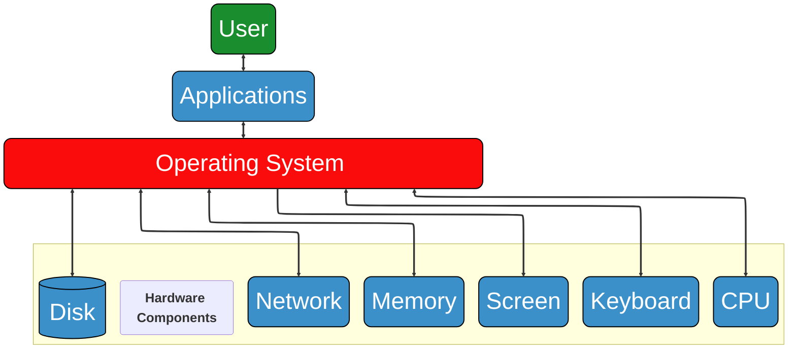

```{important} Learning outcomes
After completing this section you should be able to:
- explain fundamental computational concepts like CPU, memory, network, file system, compression, indexing
- be proficient in command line (shell) usage *#!this should be more specified I think*
```

## Introduction
In this section, you will connect to a remote server running on Linux, you will explore various computational concepts in a hands-on way and run your first bioinformatics command-line tool.


## Operating systems
```{seealso} Computing Skills for Biologists - a Tool box
- Chapter 1.1 What is Unix?
- Chapter 1.2 Why Use Unix and the Shell?
```
*#! should we explain hardware and software maybe?*

An {term}`operating system` (OS) is the software that manages computer hardware and software resources of computing devices and acts as an interface between the user and hardware [@geeksforgeeks_introduction_operating]. More simply put, an {term}`operating system` acts as a bridge between you (the user) and your computer, illustrated in {numref}`operating_system`. 


:::{figure}
:label: operating_system


Role of {term}`operating system` in connecting the user with the hardware and software of a computer
:::

An {term}`operating system` contains two basic components: 
- The {term}`kernel` is the core component of the {term}`operating system`. It contains the software libraries that are required to interact with the hardware and is therefore the primary interface between the {term}`operating system` and the hardware
- The {term}`shell` is the outermost layer of the {term}`operating system`. It acts as an intermediate between the user and the {term}`operating system`. It interprets {term}`input` for the {term}`operating system` and handles the {term}`output` from the {term}`operating system`.

Some {term}`operating system`s you might be familiar with:
- Windows
- OSX
- Linux
- Unix
- Android
- iOS
- Chrome OS


In this course, we will use [Linux](wiki:linux). It was created by [Linus Torvalds](wiki:linus_torvalds) and has various advantages:
- Linux has a powerful (remote) {term}`shell`
- Linux has many software tools available
- Supercomputers run Linux

The Linux {term}`kernel` is typically bundled with several applications into a Linux distribution to make it more user friendly. You can choose between a lot of different distributions for different purposes, for an overview see: [Linux distribution](wiki:Linux_distribution). 

We will work on the WUR Bioinformatics servers, which all run Ubuntu (one of the most popular Linux distributions). The server we will mostly work on is called [[SERVER_NAME]]. 

:::{margin}
*#! update fun fact for relevant server*
:::


## Computational concepts
We will now introduce some fundamental computational concepts. *#! add why?*

### Network
```{seealso} Computing Skills for Biologists - a Tool box
- Chapter 1.3 Getting Started with Unix
```
A {term}`network` connects different computers together. An example is the Internet. Each computer has an IP address, like 10.250.0.175, that is a unique label assigned to each device connected to a computer {term}`network` that uses the Internet Protocol for communication [@geeksforgeeks_ip]. Some computers have a hostname, like **smith**. Hostnames can have a domain: smith.**bioinformatics\.nl**.

There are different communication protocols between devices, which each use a different network port, depending on the application:
- http/https for the web
- smtp for email
- ssh for remote computing

*#! include "working on the bioinformatics servers picture in slide 18?*

Now we will connect to the server [[SERVER_NAME]]. 

```{exercise} Connecting to [[SERVER_NAME]] from ...
Follow the "Connecting to [[SERVER_NAME]] from ..." description on BrightSpace that is appropriate for your operating system (Windows or macOS). If you have another OS, ask one of the teachers.
```

If everything worked out well and you logged in to [[SERVER_NAME]], you should see a list of all our servers and their current usage, followed by a so-called {term}`prompt` [@techtarget_command_prompt]. It looks something like this:

```{code-block} bash
user001@server:~$
```

This is the {term}`command-line interface` that allows you to type all kinds of commands. The commands you type are actually handled by the {term}`shell`.


``````{exercise} Who am I?
You are now a Linux user identified by your WUR username. To see your username you can type `whoami` after the {term}`prompt`, followed by {kbd}`enter`. For example:

```{code-block} bash
:class: no-copybutton
user001@[[SERVER_NAME]]:~$ whoami
user001
```
``````

``````{exercise} Who else is on the server?
To see who else is currently on this server, you can use the `who` command:

```{code-block} bash
:class: no-copybutton
user001@[[SERVER_NAME]]:~$ who
```
This will give you a list of usernames. 

 **Do you already recognize some of your fellow students or teachers?**
``````

```{margin}
The bioinformatics servers have over one hundred active users from various research groups (Bioinformatics, Genetics, Biosystematics, Plant Physiology, Phytopathology, Host-microbe interactomics, Nematology, Virology and Wageningen Food & Biobased Research).
```


``````{exercise} What is the name of the person associated with a username?
To learn the name of the person associated with a username there is another
command:

```{code-block} bash
:class: no-copybutton
user001@[[SERVER_NAME]]:~$ finger nijve002
```
``````

The part after the command, `nijve002` in this case, is called an {term}`argument`, which specifies what the command should operate on.


### CPU, GPU and memory
The Central Processing Unit, {term}`CPU` or processor, is the brain of the computer and performs most of the calculations. Additionally, its functions are: running applications, managing {term}`input` and {term}`output` operations, and storing and retrieving data during processing [@geeksforgeeks_cpu]. Modern computers often have two or more, whereas multi-user computers (servers) often have sixteen or more. A {term}`CPU` has limited capacity (100% {term}`CPU` usage). To run programs in parallel, it has multiple cores/threads.

The Graphical Processing Unit, {term}`GPU` or video card, is a specialized processor that is optimized for doing the same calculation on many data points (in parallel). To perform like this, it has thousands of small cores. It was originally developed for computer graphics (video games), but it is now extensively used for machine learning applications (like ChatGPT). {term}`GPU`s are very good at performing many operations simultaneously, which can drastically speed up matrix calculations that are at the heart of most machine learning tasks.

A {term}`byte` is a unit of computer information consisting of a number of {term}`bit`s. It is how the amount of data amount of data that can be stored, processed, or transferred in a computer system is represented [@geeksforgeeks_memory]. 

```{list-table} Multiple-byte units
:header-rows: 1
:name: multiple-byte_units
* - Multiple-byte unit
  - Amount of bytes
  - Abbreviation
* - kilobyte
  - 1000
  - KB
* - megabyte
  - 1000{sup}`2`
  - MB
* - gigabyte
  - 1000{sup}`3`
  - MB
* - terabyte
  - 1000{sup}`4`
  - TB
* - petabyte
  - 1000{sup}`5`
  - PB
* - kibibyte
  - 1024
  - KiB
* - mebibyte
  - 1024{sup}`2`
  - MiB
* - gibibyte
  - 1024{sup}`3`
  - GiB
* - tebibyte
  - 1024{sup}`4`
  - TiB
* - pebibyte
  - 1024{sup}`5`
  - PiB
```

The {term}`memory`, or RAM, is used by programs to temporarily store information (data). Because it is temporary, it is not persistent and the data contained here is lost when power is shut off. However, it is much faster than a hard disk (long-term memory): 20-80 GB/s. A computer often has a {term}`memory` in the gigabyte range in size. Laptops/PCs often have 16-64GB, but some bioinformatic applications need over 1 TB. If the {term}`memory` is full, the hard disk is used as "overflow". This is called swapping and is very slow.

Now, let's have a look at the server.

``````{exercise} What is the server doing?
Run the command `htop` to see what the server is doing and how much {term}`memory` it has. The bars at the top show the
individual {term}`CPU`s, numbered starting at 1. Below that you can see how much {term}`memory` is available and how long the server has been running (Uptime).

```{code-block} bash
:class: no-copybutton
user001@[[SERVER_NAME]]:~$ htop
```

**How many {term}`CPU`s does the server have?** \
**How much {term}`memory` does the server have?**

In addition to the {term}`CPU` and {term}`memory` use, `htop` also shows which processes are currently running, with separate columns for the username, the used memory (RES) and the running command. The **Load average**  *#! is this a term?* tells you how busy the server is. As a rule of thumb the number indicates how many of the {term}`CPU`s are being used, if the Load average is higher than the number of {term}`CPU`s then the server is overloaded and will run less efficiently. 
*#! should this be in this exc block?*

You can exit `htop` by pressing the {kbd}`F10` or {kbd}`q`.
``````

``````{exercise} Let's have a look at another server
To connect from [[SERVER_NAME]] to a server called **doudna** you can run:

```{code-block} bash
ssh doudna
```
Also here try `htop` to see the number of {term}`CPU`s and the amount of {term}`memory`. 
```{code-block} bash
htop
```
**Does that work?**

Again, you can use {kbd}`F10` or {kbd}`q` to get out of `htop`.

The command `nproc` directly gives you the number of {term}`CPU`s:
```{code-block} bash
nproc
```

The command `free` shows the amount of {term}`memory`:
```{code-block} bash
free
```

The numbers you see can be a bit ({term}`byte` 😉) confusing. To tell `free` to report the {term}`memory` in a more human readable form, you use the {term}`option` `-h`:
```{code-block} bash
free -h
```
``````
```{margin}
Doudna is named after [Jennifer Doudna](wiki:Jennifer_Doudna), who won the Nobel prize in Chemistry for her pioneer work on CRISPR gene editing.
```

Similar to {term}`argument`s, {term}`option`s can be used to modify the behavior of command-line tools like `free`. {term}`option`s are different from {term}`argument`s in that they start with a hyphen (dash), such as `-h` in the `free` command. To make things a bit more confusing, {term}`option`s can have their own {term}`argument`s, as we will see below.
*#! might can be epxlained better with f.e. `command [-flag(s)] [-option(s) [value]] [argument(s)]`* [@uofabioinformaticshub_linux]


``````{exercise} GPUs on the doudna server
The doudna server has a couple of {term}`GPU`s. To see the {term}`GPU`s in action, run the `nvtop` command:

```{code-block} bash
nvtop
```

**What kind of {term}`GPU`s are in doudna?** (look between the square brackets)

The company making these {term}`GPU`s is currently one of the World's most valuable companies.

Leave doudna to come back to [[SERVER_NAME]] by either running `exit` or using {kbd}`Ctrl`+{kbd}`d`.
``````

Back on [[SERVER_NAME]], let's have a look at the data storage locations.

``````{exercise} Data storage
The `df` command shows the available disks and their sizes. If you run it, you will get quite a long list. With some {term}`option`s we can filter the list:

```{code-block} bash
df -h -l --type ext4
```
- `-h` for human readable sizes
- `-l` local, to see disks that are in the server
- `--type ext4` for disks that use the Linux {term}`file system`

**How many local disks do you see and how large are they?**
``````

{term}`option`s for commands often come in single letter variants that start with a single hyphen, and a more informative alternative, starting with two hyphens. In this case we can use `--type` or `-t`. The term `ext4` is an {term}`argument` that goes with the `--type` {term}`option`.


``````{exercise} Look up the manual for a command
If you are starting to get lost in the commands, {term}`option`s and {term}`argument`s, no worries: Linux comes with a manual:
```{code-block} bash
man df
```
``````

The server also has access to a number of disks that are on a different server, so-called mounted drives *#! term or foot-note?*. These are available on all our servers, so we can easily move an analysis to another server without having to move the data.

``````{exercise} Storage on mounted drives
Every user on a Linux server has a home directory in which they can store files. The home directories for all our users are on one of these mounted drives:
```{code-block} bash
df -h /home
```

This mounted home drive is not very large, considering the number of users, so we have an another mounted drive for storing data that is much larger. Check the size of the `/lustre/BIF` drive and how much is already in use:
```{code-block} bash
df -h /lustre/BIF
```
``````

### File system
```{seealso} Computing Skills for Biologists - a Tool box
- Chapter 1.4 Getting Started with the Shell
- Chapter 1.5 Basic Unix Commands
```
The {term}`file system` is the system that organizes how files are stored on a hard disk. Many different {term}`file system`s exist, differing in:
- maximum file size
- security
- redundancy
- speed
- etc.

Example of {term}`file system`s are: NTFS, FAT32, EXT4, and ZFS. The size of {term}`file system`s are nowadays in the terabyte range. {term}`file system`s are often organized in a directory or folder structure as illustrated in {numref}`file_system_structure`.

:::{figure}
:label: file_system_structure
```{mermaid}
flowchart TD
    %% Define the directories
    Root["/root"]
    Bin["bin"]
    Usr["usr"]
    Home["home"]
    PC["BIF21806"]

    %% Create the hierarchical connections
    Root --> Bin
    Root --> Usr
    Root --> Home
    Home --> PC

    %% Optional: Add a simple style to make them look like folders
    classDef folder fill:#3b90ca,stroke:#000,stroke-width:2px,color:white,rx:5,ry:5;
    class Root,Bin,Usr,Home,PC folder;
```
Example hierarchical folder/directory structure of a {term}`file system`
:::

On a Linux server you are always inside a directory, starting out in your home directory.

``````{exercise} What is your current directory?
To see your current directory, use the `pwd` command:
```{code-block} bash
pwd
```
``````

``````{exercise} What is in your current directory?
Use the `ls` command to see the files and directories in your current directory.

```{code-block} bash
ls
```

Like most commands, `ls` also has a number of {term}`option`s to alter its behavior. Add
the `-a` {term}`option`:
```{code-block} bash
ls -a
```

**What do you think the `-a` {term}`option` does?**

Check your assumption in the manual for `ls`:
```{code-block} bash
man ls
```
``````

```{tip}
Use the {kbd}`↑` (up-arrow) to scroll through your command-line history.
```

You can think of the directory structure in Linux as a tree with a root and a lot of
branches extending from this root ({numref}`file_system_structure`). 

``````{exercise} List all the files in root
To list the files in the root of the system you can simply use: 
```{code-block} bash
ls /
```
``````

So, the `/home/user001` directory is two levels away from the root.

``````{exercise} Move to a different directory
To move to a different directory, you can use the `cd` command, for **c**hange **d**irectory. Move to the directory `/bin` using:
```{code-block} bash
cd /bin
```
Use `ls` to see the files, most are programs that you can run. 

```{code-block} bash
ls
```

Also, the program that handles all your commands, the {term}`shell`, is located here: `/bin/bash`
``````

*#! Insert python sidenote here?*

``````{exercise} Listing everything that matches a pattern *#! idk*
Another location for useful programs is `/usr/bin`. To only list the programs in `/usr/bin` for which the filename starts with 'bla', run: 
```{code-block} bash
ls /usr/bin/bla*
```
In the list of files, you should see the program `blastp` that we will use at the end of this practical.

To find programs that contain 'seq' in their name, try:
```{code-block} bash
ls /usr/bin/*seq*
```
To find programs that start with a 'q' or a 'z', try: 

```{code-block} bash
ls /usr/bin/[qz]*
```
``````

An {term}`absolute path` points to a fixed position in the directory tree, like `/usr/bin`. A {term}`relative path` is the path from your current location in the directory tree to the designated location. A {term}`relative path` does not start with `/`.


``````{exercise} Absolute and relative paths
Compare what you get with the following commands (in this order):

```{code-block} bash
cd /usr
```

```{code-block} bash
cd bin
```

```{code-block} bash
pwd
```

```{code-block} bash
cd /bin
```

```{code-block} bash
pwd
```

```{code-block} bash
cd bin
```

The last `cd` gave an error, because there is no `/bin/bin` directory.

In {term}`relative path`s you can use `..` to move up one directory and `.` for the current
directory:

```{code-block} bash
cd /home
```
**#! change to your username?**
```{code-block} bash
cd ./user001 
```

```{code-block} bash
cd ../../usr/bin
```
``````

``````{exercise} Go back to home
Go back to your home directory using `cd` without any {term}`option`s or attributes (your home directory is the default): *#! explain attribute?*
```{code-block} bash
cd
```
Or with `cd ~` (the tilde is shorthand for your home directory):
```{code-block} bash
cd ~
```
``````

``````{exercise} Creating a new directory
Create a new directory called `exercises` using the command `mkdir`. Inside that directory, create a directory called `week1`, and inside that directory create a directory called `day1_2`. 
```{code-block} bash
mkdire exercises
```
Move to the `exercises` directory with the command you've just learned
```{code-block} bash
mkdir week1
```
Move to the `week1` directory and make the `day1_2` directory with the commands you've just learned.

Alternatively, you can create all three directories in one command using the `-p` {term}`option`.
```{code-block} bash
mkdir -p exercises/week1/day1_2
```
``````


### I/O (Input/Output) and compression
The {term}`input` of a program is the source of incoming information (data). For example:
- Your keyboard
- A file
- A {term}`network`
- {term}`memory`

The {term}`output` is the destination of the outgoing information. For example:
- Your screen
- A file
- A {term}`network`
- {term}`memory`

The I/O can be a performance bottleneck for computations.

Text data is usually not stored efficiently in a {term}`file system`. For example, a text file with 1,000,000 times the letter 'a' will take up 1,000,000 {term}`byte`s of disk space (1 megabyte). To save space and {term}`network` transfer time, data files are often compressed (zipped) using clever algorithms. 

Compressed files:
- are much smaller
- cannot be used directly, must be uncompressed (unzipped)
- typically have file name extensions like: `.zip` or `.gz`


``````{exercise} Working with text: DNA sequence of human chromosome 22
To explore working with text in a {term}`command-line interface`, we will first download the sequence of human chromosome 22 from the ENSEMBL website. 

Make sure you are in the `exercises/week1/day1_2` directory.

Downloading from a website usually requires a web browser. There is a command-line browser:
```{code-block} bash
lynx www.ensembl.org
```
This is not very user friendly. Fortunately, there is a command called `wget` that allows you to download a file from a website: (the URL is too long for one line)
```{code-block} bash
wget https://ftp.ensembl.org/pub/release-114/fasta/homo_sapiens/dna/Homo_sapiens.GRCh38.dna.chromosome.22.fa.gz
```

**What is the size of the file in {term}`byte`s?**

```{code-block} bash
ls -l
```

The length in nucleotides of human chromosome 22 is 50,818,468. Knowing that and the size of the file, you can determine the ratio of {term}`byte`s per nucleotide. Now you could use a calculator, but for now let's do a preview to the next part of the course and use Python to do the calculation. 

Python is a programming language that is very popular for all kinds of analyses. It is available on [[SERVER_NAME]] as the
command-line program `python3`, run it like this: (replace `file_size` with the number you found with `ls -l`)

```{code-block} bash
:class: no-copybutton
user001@[[SERVER_NAME]]:~/exercises/week1/day1_2$ python3
user001@[[SERVER_NAME]]:/usr/local/bin$ python3
Python 3.13.6 (main, Aug 7 2025, 18:15:40) [GCC 11.4.0] on linux
Type "help", "copyright", "credits" or "license" for more
information.
>>> file_size / 50818468
```

**What is the ratio of {term}`byte`s per nucleotide?**

Exit Python using {kbd}`Ctrl`+{kbd}`d`.

Before continuing with the downloaded chromosome 22 sequence, examine the type of the downloaded file type using the command `file`:

```{code-block} bash
file Homo_sapiens.GRCh38.dna.chromosome.22.fa.gz
```

This should tell you that the file is compressed (to save space), the filename extension `.gz` also indicates that. 

A compressed file cannot be read directly, you first should uncompress/unzip it using `gunzip`:
```{code-block} bash
gunzip Homo_sapiens.GRCh38.dna.chromosome.22.fa.gz
```

Again, check the size of the now uncompressed file in {term}`byte`s using Python.

For most text files on a Linux system, one character takes up exactly one {term}`byte`.

**Now what is the ratio of {term}`byte`s per nucleotide?**
``````

Reading text files on a Linux system can be done with a number of programs, from the very simply `cat` and `more`, to more versatile text editors like `nano` and `vim`. Especially `vim` is quite powerful, but also very challenging to use.

``````{exercise} Accounting for all bytes in the file: DNA sequence of human chromosome 22
To view the uncompressed file, we will use the program `less`, which deceptively is actually more advanced than the program `more`:

```{code-block} bash
less Homo_sapiens.GRCh38.dna.chromosome.22.fa
```

The text file starts with a description line, followed by many lines with the actual sequence. This follows the so-called [FASTA format](wiki:fasta_format) for sequence files (hence the `.fa` filename extension)

Looking at the nucleotides in the first lines of the sequence, you may notice that these are not informative, the same goes for the last part of the sequence (jump to the end of the file with the {kbd}`Shift`+{kbd}`g` combination and back to the top with just the {kbd}`g`). Apparently, the telomeric ends of the chromosome are not very well characterized.

Let's try to account for all {term}`byte`s in the FASTA file. The bulk of the file consists of nucleotides, but these do not add up to the number of {term}`byte`s in the file, even if you add the 56 characters of the first line. 

**What is the difference?**

**What is taking up these remaining {term}`byte`s?** As a clue, let's count the lines of the file.

First exit `less` by pressing {kbd}`q` and then use the `wc` program like this:
```{code-block} bash
wc -l Homo_sapiens.GRCh38.dna.chromosome.22.fa
```
**Do you recognize the number?**

How does `less` know when to break to the next line? That information is stored in the text file, in the form of a hidden character, which can be visualized like this (for the first 200 characters of the file):
```{code-block} bash
od -c -N 200 Homo_sapiens.GRCh38.dna.chromosome.22.fa
```
The `\n` is called the **newline** character, which takes up one {term}`byte` per line.

With these newline characters we should have accounted for all {term}`byte`s in the file.

Now we are finished with the chromosome 22 file, you can remove it to save space on our home drive:
```{code-block} bash
rm Homo_sapiens.GRCh38.dna.chromosome.22.fa
```
``````

```{attention}
Removing a file on a Linux {term}`file system` is irreversible, without an undo option.
*#! I would add that it is better to first check whether the path you are selecting to remove only contains the files you want to remove by running `ls` first before running `rm`*
```


### Indexing
An {term}`index` can help to quickly find some information in a large file, like an index at the end of a book. Usually, the {term}`index` of a file is stored in a separate file. The structure depends on the kind of data that is indexed. It is mainly created and used by computer programs. 

One application is to make a genome of an organism better searchable, as was done for the plant *Arabidopsis thaliana* in {numref}`index_a_thaliana`.

```{list-table} Index of a file with the genome of *Arabidopsis thaliana*
:header-rows: 1
:name: index_a_thaliana
* - Name
  - Length (bases)
  - Offset (bytes)
* - Chr1 
  - 30427671 
  - 55
* - Chr2 
  - 19698289 
  - 30934909
* - Chr3 
  - 23459830 
  - 50961558
* - Chr4 
  - 18585056 
  - 74812441 
* - Chr5 
  - 26975502 
  - 93707303
```

Now, let's do some biology on the command-line. One of the most used programs in bioinformatics is called BLAST.

With BLAST you can search for a protein or nucleotide sequence in a database of known sequences. It does not only find exact matches, but also similar sequences. This allows you to look for homologous sequences. These are
sequences that originate from the same ancestral gene, for instance the human hemoglobin beta and delta proteins have a very similar amino acid sequence.

BLAST is extensively covered in the [Introduction to Bioinformatics](https://wur-bioinformatics.github.io/introduction-to-bioinformatics/chapter2/#blast) course. Most researchers will use BLAST via the [NCBI website](https://blast.ncbi.nlm.nih.gov/Blast.cgi), which works fine for a few sequences. If you have a lot of protein or nucleotide sequences that you want to search, using BLAST from the command-line is more efficient. 


``````{exercise} command-line BLAST a protein sequence
Using the command `cp`, copy the file `proteinX.fasta` from the `/mnt/local_scratch/BIF21806` directory to your `day1_2` directory.

Inspect the file with `less` to see that it contains one protein sequence in FASTA format. 

We will search for it in the human protein sequences from the SwissProt database. SwissProt contains high-quality manually annotated and reviewed protein sequences [@uniprot_2022].

Copy the file `sp_human_single_line.fasta` from `/mnt/local_scratch/BIF21806` to your `day1_2` directory.

Create a BLAST database of the `sp_human_single_line.fasta` file using: 

```{code-block} bash
makeblastdb -in sp_human_single_line.fasta -out sp_human
```

This should create a BLAST database called sp_human, but something is still missing. Look in the {term}`option`s for `makeblastdb` to solve the problem:
```{code-block} bash
makeblastdb -help
```

When you've found the right {term}`option`, make the BLAST database with the corrected command. The database uses an {term}`index` to find sequences faster.

The BLAST command-line programs come is several [flavors](https://wur-bioinformatics.github.io/introduction-to-bioinformatics/chapter2/#blast-types), depending on whether you want to search protein or nucleotide sequences, in a protein or a nucleotide database. In this case we want to search a protein database for a protein sequence, which requires `blastp`.

First, to get an overview of the {term}`option`s, run:

```{code-block} bash
blastp -help
```

**What is the {term}`option` to provide the query FASTA file?** \
**What is the {term}`option` to provide the name of the database?**\
**What is the {term}`option` to specify the name of the {term}`output` file?**

Run `blastp` with the appropriate parameters for the three {term}`option`s mentioned above, call the {term}`output` file: `proteinX.blast`

Use the `less` command to view the {term}`output` file. 

**What is proteinX?**

Now run `blastp` again , but change the {term}`output` file name to `proteinX.html` and add the {term}`option` `-html`.

The resulting file can be viewed in a web browser, so let's copy it over to your own computer. The easiest way to do that is to use the `scp` command on your computer:

```{code-block} bash
scp [[SERVER_NAME]]:~/exercises/week1/day1_2/proteinX.html .
```

Locate the file on your computer and open it with a web browser.

Congratulations, you completed your first command-line bioinformatics analysis! 🎉
``````


## Glossary
```{glossary}
operating system
: Software that manages computer hardware and software resources of a computing devices and acts as an interface between user and hardware.

kernel
: Core component of the operating system. It is the primary interface between the operating system an the hardware, containing the software libraries that are required to interact with the hardware.

shell
: Outermost layer of the operating system, acting as an intermediate between the user and the operating system.

prompt
: Input field in a text-based user interface screen for an operating system.

command-line interface
: Text-based interface for the user to interact with an operating system.

CPU
: **C**entral **P**rocessing **U**nit. The brain of the computer that executes instructions and manages operations. 

GPU
: **G**raphical **P**rocessing **U**nit. A specialized processor that is optimized for doing the same calculation on many data points.

byte
: A unit of computer information consisting of a number of bits, usually eight bits.

bit
: A unit of information that is either 0 or 1.

memory
: Temporary storage used by programs.

argument
: Value passed to a program that specifies the input or modifies the behaviour.

option
: Setting built into the command program (or script), that alters the default behaviour of the program.

file system
: System that organizes how files are stored on a hard disk.

absolute path
: Path that points to a fixed position in the directory tree.

relative path
: Path that points to a position in the directory tree from your current position.

compression
: Reducing the size of a data file to save space and network transfer time.

network
: Connects different computers together.

input
: The source of incoming information (data).

output
: The destination of the outgoing information (data).

index
: A data structure that stores and organizes information within a file in such a way that it is easy to find.
```
