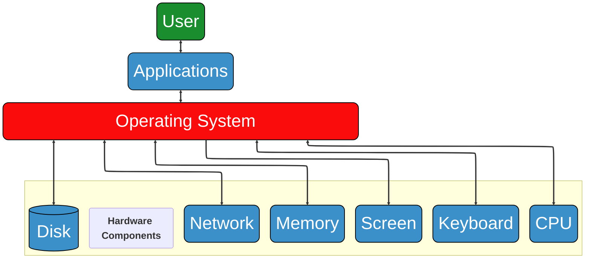

```{important} Learning outcomes
After completing this section you should be able to:
- explain fundamental computational concepts like CPU, memory, network, file system, compression, indexing
- execute remote connections to a Linux system using ssh
```

## Introduction
Biological data analysis can often be performed using ready-made {term}`software` such as Excel or tools designed for a specific task. These programs are convenient, but they also limit which analyses you can perform and how much control you have over the process. In this course, you will learn to work in a flexible computing environment in which you can build and run your own analyses. This will allow you to adapt workflows to your research questions, the structure of your data, and the available computing resources.


## Operating Systems
A computer system consists of {term}`hardware` and {term}`software`. {term}`Hardware <hardware>` are the physical components, whereas {term}`software` are the programs and applications that control the {term}`hardware`. An {term}`operating system` (OS) is the {term}`software` that manages computer {term}`hardware` and {term}`software` resources of computing devices and acts as an interface between the user and {term}`hardware` [@geeksforgeeks_introduction_operating]. More simply put, an {term}`operating system` acts as a bridge between you (the user) and your computer, illustrated in {numref}`operating_system`. 


:::{figure}
:label: operating_system


Role of {term}`operating system` in connecting the user with the {term}`hardware` and {term}`software` of a computer
:::

An {term}`operating system` contains two basic components: 
- The {term}`kernel` is the core component of the {term}`operating system`. It contains the {term}`software` libraries that are required to interact with the {term}`hardware` and is therefore the primary interface between the {term}`operating system` and the {term}`hardware`
- The {term}`shell` is the outermost layer of the {term}`operating system`. It acts as an intermediate between the user and the {term}`operating system`. It interprets {term}`input` for the {term}`operating system` and handles the {term}`output` from the {term}`operating system`.

Some {term}`operating system`s you might be familiar with:
- Windows
- OSX
- Linux
- Unix
- Android
- iOS
- Chrome OS


In this course, we will use [Linux](wiki:linux). It was created by [Linus Torvalds](wiki:linus_torvalds) and has various advantages:
- Linux has a powerful (remote) {term}`shell`
- Linux has many {term}`software` tools available
- Supercomputers run Linux

The Linux {term}`kernel` is typically bundled with several applications into a Linux distribution to make it more user friendly. You can choose between a lot of different distributions for different purposes, for an overview see: [Linux distribution](wiki:Linux_distribution). 

We will work on the WUR Bioinformatics servers, which all run Ubuntu (one of the most popular Linux distributions). The server we will mostly work on is called [[SERVER_NAME]]. Servers are not always connected to the internet. Therefore, it is necessary to jump from your computer via a host or proxy server to the WUR Bioinformatics servers. 

:::{margin}
*#! update fun fact for relevant server*
:::

```{figure} img/working_on_remote_server.png
:label: working_on_remote_server_img

Working on WUR Bioinformatics servers
```

```{seealso} Further Reading
Computing Skills for Biologists - a Tool box
- Chapter 1.1 What is Unix?
- Chapter 1.2 Why Use Unix and the Shell?
```
## Computational Concepts
We will now introduce some fundamental computational concepts. *#! add why?*

### Network
A {term}`network` connects different computers together. An example is the Internet. Each computer has an IP address, like 10.250.0.175, that is a unique label assigned to each device connected to a computer {term}`network` that uses the Internet Protocol for communication [@geeksforgeeks_ip]. Some computers have a hostname, like **smith**. Hostnames can have a domain: smith.**bioinformatics\.nl**.

There are different communication protocols between devices, which each use a different {term}`network port`, depending on the application ([](#network_ports)). You can imagine these {term}`network ports  <network port>` to act like a service desk at for example the municipality: for each service there is a different desk, one for getting a new passport, one for getting married, one for registering yourself when you have just moved, etc.. Similarly, each {term}`network port` serves as a virtual connection to provide different services. [@geeksforgeeks_networkport_2025 ; @juric_port_nodate]

```{list-table} Examples of network ports
:header-rows: 1
:name: network_ports
* - Network port
  - Abbreviation
  - Service
* - 22
  - SSH
  - Remote computing
* - 25
  - SMTP
  - Server-to-server email
* - 80
  - HTTP
  - Unencrypted web traffic
* - 443
  - HTTPS
  - Encrypted web traffic
* - 3000
  - HTTP 
  - Local web development
```

### CPU, GPU and Memory
The Central Processing Unit, {term}`CPU` or processor, is the brain of the computer and performs most of the calculations. Additionally, its functions are: running applications, managing {term}`input` and {term}`output` operations, and storing and retrieving data during processing [@geeksforgeeks_cpu]. Modern computers often have two or more, whereas multi-user computers (servers) often have sixteen or more. A {term}`CPU` has limited capacity (100% {term}`CPU` usage). To run programs in parallel, it has multiple cores/threads.

The Graphical Processing Unit, {term}`GPU` or video card, is a specialized processor that is optimized for doing the same calculation on many data points (in parallel). To perform like this, it has thousands of small cores. It was originally developed for computer graphics (video games), but it is now extensively used for machine learning applications (like ChatGPT). {term}`GPU`s are very good at performing many operations simultaneously, which can drastically speed up matrix calculations that are at the heart of most machine learning tasks.

A {term}`byte` is a unit of computer information consisting of a number of {term}`bit`s. It is how the amount of data amount of data that can be stored, processed, or transferred in a computer system is represented [@geeksforgeeks_memory]. 

```{list-table} Multiple-byte units
:header-rows: 1
:name: multiple-byte_units
* - Multiple-byte unit
  - Amount of bytes
  - Abbreviation
* - kilobyte
  - 1000
  - KB
* - megabyte
  - 1000{sup}`2`
  - MB
* - gigabyte
  - 1000{sup}`3`
  - MB
* - terabyte
  - 1000{sup}`4`
  - TB
* - petabyte
  - 1000{sup}`5`
  - PB
* - kibibyte
  - 1024
  - KiB
* - mebibyte
  - 1024{sup}`2`
  - MiB
* - gibibyte
  - 1024{sup}`3`
  - GiB
* - tebibyte
  - 1024{sup}`4`
  - TiB
* - pebibyte
  - 1024{sup}`5`
  - PiB
```

The {term}`memory`, or RAM, is used by programs to temporarily store information (data). Because it is temporary, it is not persistent and the data contained here is lost when power is shut off. However, it is much faster than a hard disk (long-term memory): 20-80 GB/s. A computer often has a {term}`memory` in the gigabyte range in size. Laptops/PCs often have 16-64GB, but some bioinformatic applications need over 1 TB. If the {term}`memory` is full, the hard disk is used as "overflow". This is called swapping and is very slow.


### File System
The {term}`file system` is the system that organizes how files are stored on a hard disk. Many different {term}`file system`s exist, differing in:
- maximum file size
- security
- redundancy
- speed
- etc.

Example of {term}`file system`s are: NTFS, FAT32, EXT4, and ZFS. The size of {term}`file system`s are nowadays in the terabyte range. {term}`file system`s are often organized in a directory or folder structure as illustrated in {numref}`file_system_structure`.

:::{figure}
:label: file_system_structure
```{mermaid}
flowchart TD
    %% Define the directories
    Root["/root"]
    Bin["bin"]
    Usr["usr"]
    Home["home"]
    PC["BIF21806"]

    %% Create the hierarchical connections
    Root --> Bin
    Root --> Usr
    Root --> Home
    Home --> PC

    %% Optional: Add a simple style to make them look like folders
    classDef folder fill:#3b90ca,stroke:#000,stroke-width:2px,color:white,rx:5,ry:5;
    class Root,Bin,Usr,Home,PC folder;
```
Example hierarchical folder/directory structure of a {term}`file system`
:::


```{seealso} Further Reading
Computing Skills for Biologists - a Tool box
- Chapter 1.4 Getting Started with the Shell
- Chapter 1.5 Basic Unix Commands *#! more specific*
```

### I/O (Input/Output) and Compression
The {term}`input` of a program is the source of incoming information (data). For example:
- Your keyboard
- A file
- A {term}`network`
- {term}`memory`

The {term}`output` is the destination of the outgoing information. For example:
- Your screen
- A file
- A {term}`network`
- {term}`memory`

The I/O can be a performance bottleneck for computations.

Text data is usually not stored efficiently in a {term}`file system`. For example, a text file with 1,000,000 times the letter 'a' will take up 1,000,000 {term}`byte`s of disk space (1 megabyte). To save space and {term}`network` transfer time, data files are often compressed (zipped) using clever algorithms. 

Compressed files:
- are much smaller
- cannot be used directly, must be uncompressed (unzipped)
- typically have file name extensions like: `.zip` or `.gz`


### Indexing
An {term}`index` can help to quickly find some information in a large file, like an index at the end of a book. Usually, the {term}`index` of a file is stored in a separate file. The structure depends on the kind of data that is indexed. It is mainly created and used by computer programs. 

One application is to make a genome of an organism better searchable, as was done for the plant *Arabidopsis thaliana* in {numref}`index_a_thaliana`.

```{list-table} Index of a file with the genome of *Arabidopsis thaliana*
:header-rows: 1
:name: index_a_thaliana
* - Name
  - Length (bases)
  - Offset (bytes)
* - Chr1 
  - 30427671 
  - 55
* - Chr2 
  - 19698289 
  - 30934909
* - Chr3 
  - 23459830 
  - 50961558
* - Chr4 
  - 18585056 
  - 74812441 
* - Chr5 
  - 26975502 
  - 93707303
```

## Exercises

### Connecting to a server
Now we will connect to the server [[SERVER_NAME]]. 

```{exercise} Connecting to [[SERVER_NAME]] from ...
Follow the "Connecting to [[SERVER_NAME]] from ..." description on BrightSpace that is appropriate for your operating system (Windows or macOS). If you have another OS, ask one of the teachers.
```

If everything worked out well and you logged in to [[SERVER_NAME]], you should see a list of all our servers and their current usage, followed by a so-called {term}`prompt` [@techtarget_command_prompt]. It looks something like this:

```{code-block} bash
user001@server:~$
```

This is the {term}`command-line interface` that allows you to type all kinds of commands. The commands you type are actually handled by the {term}`shell`.


### Looking around the server

``````{exercise} Who am I?
You are now a Linux user identified by your WUR username. To see your username you can type `whoami` after the {term}`prompt`, followed by {kbd}`enter`. For example:

```{code-block} bash
:class: no-copybutton
user001@[[SERVER_NAME]]:~$ whoami
user001
```
``````

``````{exercise} Who else is on the server?
To see who else is currently on this server, you can use the `who` command:

```{code-block} bash
:class: no-copybutton
user001@[[SERVER_NAME]]:~$ who
```
This will give you a list of usernames. 

 **Do you already recognize some of your fellow students or teachers?**
``````

```{margin}
The bioinformatics servers have over one hundred active users from various research groups (Bioinformatics, Genetics, Biosystematics, Plant Physiology, Phytopathology, Host-microbe interactomics, Nematology, Virology and Wageningen Food & Biobased Research).
```


``````{exercise} What is the name of the person associated with a username?
To learn the name of the person associated with a username there is another
command:

```{code-block} bash
:class: no-copybutton
user001@[[SERVER_NAME]]:~$ finger nijve002
```
``````

The part after the command, `nijve002` in this case, is called an {term}`argument`, which specifies what the command should operate on.

Now, let's have a look at the server.

``````{exercise} What is the server doing?
Run the command `htop` to see what the server is doing and how much {term}`memory` it has. The bars at the top show the
individual {term}`CPU`s, numbered starting at 1. Below that you can see how much {term}`memory` is available and how long the server has been running (Uptime).

```{code-block} bash
:class: no-copybutton
user001@[[SERVER_NAME]]:~$ htop
```

**How many {term}`CPU`s does the server have?** \
**How much {term}`memory` does the server have?**

In addition to the {term}`CPU` and {term}`memory` use, `htop` also shows which processes are currently running, with separate columns for the username, the used memory (RES) and the running command. The **Load average**  *#! is this a term?* tells you how busy the server is. As a rule of thumb the number indicates how many of the {term}`CPU`s are being used, if the Load average is higher than the number of {term}`CPU`s then the server is overloaded and will run less efficiently. 
*#! should this be in this exc block?*

You can exit `htop` by pressing the {kbd}`F10` or {kbd}`q`.
``````

``````{exercise} Let's have a look at another server
To connect from [[SERVER_NAME]] to a server called **doudna** you can run:

```{code-block} bash
ssh doudna
```
Also here try `htop` to see the number of {term}`CPU`s and the amount of {term}`memory`. 
```{code-block} bash
htop
```
**Does that work?**

Again, you can use {kbd}`F10` or {kbd}`q` to get out of `htop`.

The command `nproc` directly gives you the number of {term}`CPU`s:
```{code-block} bash
nproc
```

The command `free` shows the amount of {term}`memory`:
```{code-block} bash
free
```

The numbers you see can be a bit ({term}`byte` 😉) confusing. To tell `free` to report the {term}`memory` in a more human readable form, you use the {term}`option` `-h`:
```{code-block} bash
free -h
```
``````
```{margin}
Doudna is named after [Jennifer Doudna](wiki:Jennifer_Doudna), who won the Nobel prize in Chemistry for her pioneer work on CRISPR gene editing.
```

Similar to {term}`argument`s, {term}`option`s can be used to modify the behavior of command-line tools like `free`. {term}`option`s are different from {term}`argument`s in that they start with a hyphen (dash), such as `-h` in the `free` command. To make things a bit more confusing, {term}`option`s can have their own {term}`argument`s, as we will see below.
*#! might can be epxlained better with f.e. `command [-flag(s)] [-option(s) [value]] [argument(s)]`* [@uofabioinformaticshub_linux]


``````{exercise} GPUs on the doudna server
The doudna server has a couple of {term}`GPU`s. To see the {term}`GPU`s in action, run the `nvtop` command:

```{code-block} bash
nvtop
```

**What kind of {term}`GPU`s are in doudna?** (look between the square brackets)

The company making these {term}`GPU`s is currently one of the World's most valuable companies.

Leave doudna to come back to [[SERVER_NAME]] by either running `exit` or using {kbd}`Ctrl`+{kbd}`d`.
``````

### Data storage

Back on [[SERVER_NAME]], let's have a look at the data storage locations.

``````{exercise} Data storage
The `df` command shows the available disks and their sizes. If you run it, you will get quite a long list. With some {term}`option`s we can filter the list:

```{code-block} bash
df -h -l --type ext4
```
- `-h` for human readable sizes
- `-l` local, to see disks that are in the server
- `--type ext4` for disks that use the Linux {term}`file system`

**How many local disks do you see and how large are they?**
``````

{term}`option`s for commands often come in single letter variants that start with a single hyphen, and a more informative alternative, starting with two hyphens. In this case we can use `--type` or `-t`. The term `ext4` is an {term}`argument` that goes with the `--type` {term}`option`.


``````{exercise} Look up the manual for a command
If you are starting to get lost in the commands, {term}`option`s and {term}`argument`s, no worries: Linux comes with a manual:
```{code-block} bash
man df
```
``````

The server also has access to a number of disks that are on a different server, so-called mounted drives *#! term or foot-note?*. These are available on all our servers, so we can easily move an analysis to another server without having to move the data.

``````{exercise} Storage on mounted drives
Every user on a Linux server has a home directory in which they can store files. The home directories for all our users are on one of these mounted drives:
```{code-block} bash
df -h /home
```

This mounted home drive is not very large, considering the number of users, so we have an another mounted drive for storing data that is much larger. Check the size of the `/lustre/BIF` drive and how much is already in use:
```{code-block} bash
df -h /lustre/BIF
```
``````

